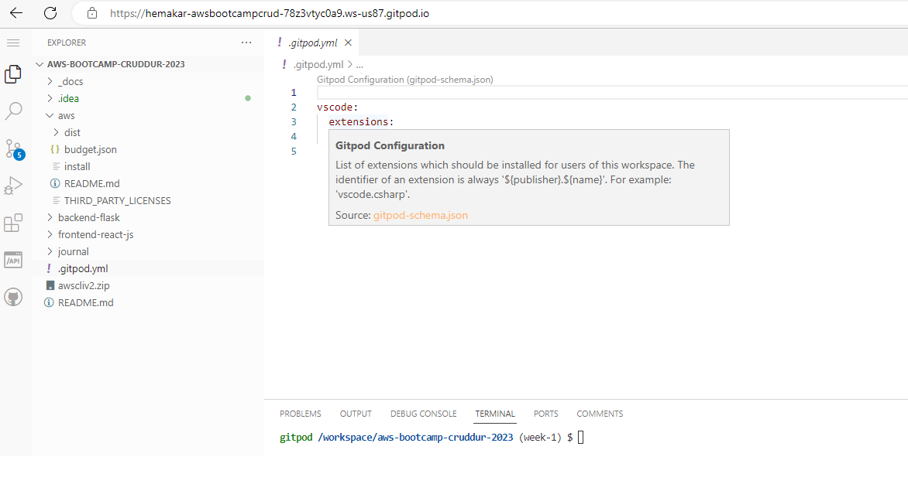
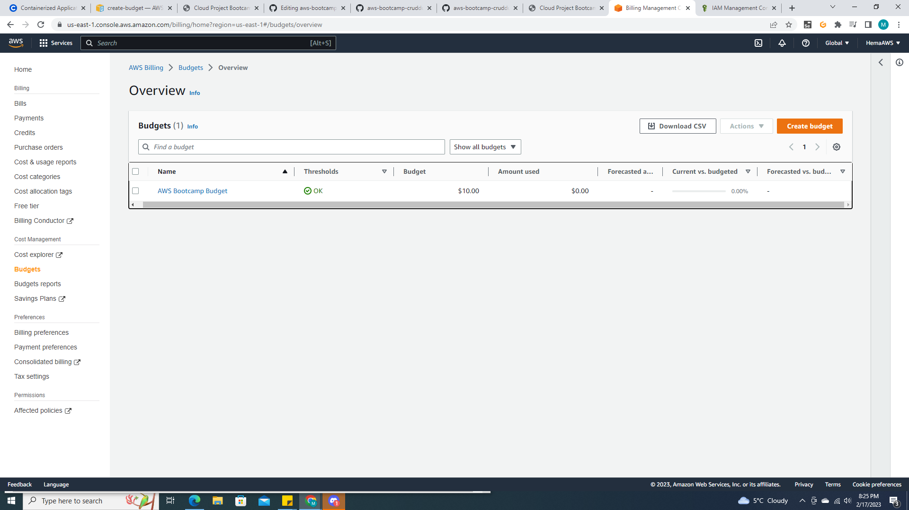
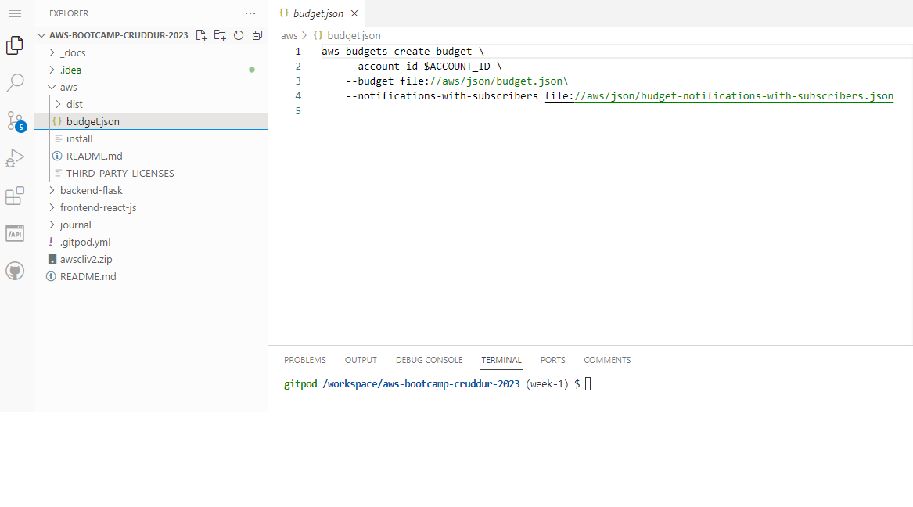

# Week 0 — Billing and Architecture

## Required Homework

### Install AWS CLI

I was able to use Gitpod but for some reason I dont' see the code here. I had trouble with Github and commit, I'm still learning to use Github, but I can provide the details of the instructions below

I am able to see only this code below in .gitpod.yml.

`vscode:
  extensions:
    - 42Crunch.vscode-openapi`

### Instructions of CLI installation in gitpod (Linux)

```
curl "https://awscli.amazonaws.com/awscli-exe-linux-x86_64.zip" -o "awscliv2.zip"
unzip awscliv2.zip'
sudo ./aws/install

```



I was able to set up the environment variables using the following code 

```
export AWS_ACCESS_KEY_ID= (I used my access key I created earlier on my IAM account)
export AWS_SECRET_ACCESS_KEY= (I used my secret access key I created earlier on my IAM account)
export AWS_DEFAULT_REGION=us-east-1

```
I followed the steps from the video and commited by creating a Week -1 branch and was not successful. The code did not save and I was not able to see the commit changes in the gitpod.yml . I was helped by a team mate and now I am able to see the Week-1 branch on github however, I don't have the details in it. 

### Created Json file to create - budget in CLI

Setting up budget proof - I set up only one since setting up two budgets is allowed in free tier.
I set the budget for $10.


```
aws budgets create-budget \
    --account-id 111122223333 \
    --budget file://budget.json \
    --notifications-with-subscribers file://notifications-with-subscribers.json
```



### Billing Alarm 

Setting up Alarm proof


## Recreate Logical Design
[Lucid Charts SHare Link](https://lucid.app/lucidchart/d1407ad3-3f3d-4015-a3b1-36adbcfb8061/edit?viewport_loc=-172%2C-280%2C2218%2C1612%2CO__xqT0hEh-a&invitationId=inv_7919566f-49fa-4510-8171-ea7c72ce9235)

![Logical Design] (assets/Logical.png)

## Recreate Conceptual Design
[Lucid Charts SHare Link] (https://lucid.app/lucidchart/d1407ad3-3f3d-4015-a3b1-36adbcfb8061/edit?viewport_loc=-1102%2C-358%2C2218%2C1612%2C0_0&invitationId=inv_7919566f-49fa-4510-8171-ea7c72ce9235)

![Conceptual Design] (assets/CruddurLogicaldesign.png)

## Homework Challenges

### I've set up MFA's for root and IAM. 

I've used the QR code and Google auth for MFA.
Created Admin access and set up Admin policies. 
